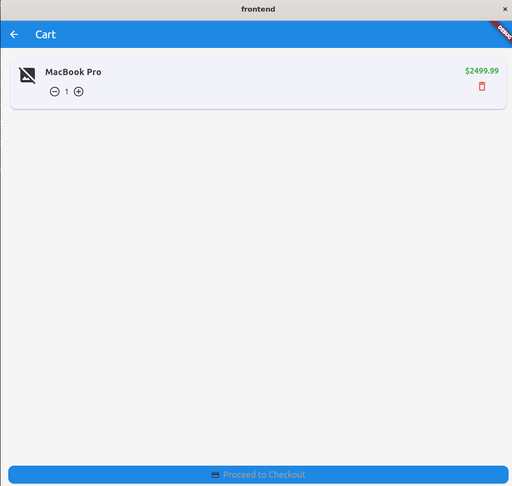
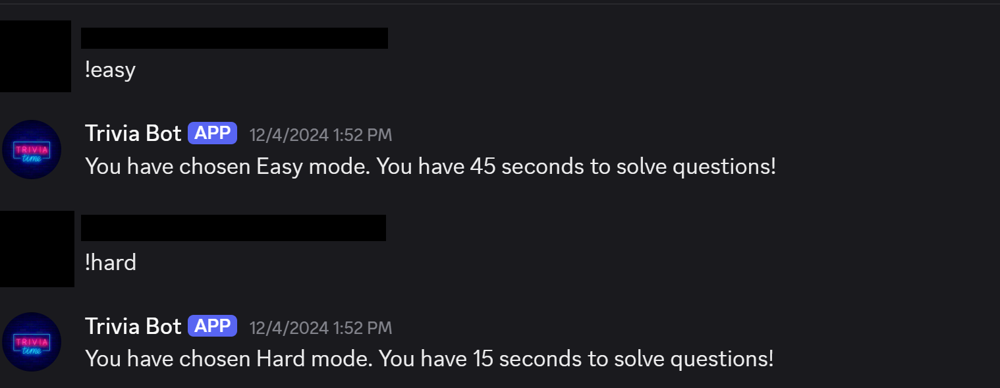

# Project Portfolio

# Warehouse Management App

## Project Description

This project provides a warehouse management and customer ordering solution built with Flutter for the frontend and Node.js/Express for the backend.  
Customers can browse and order products while admins and employees manage inventory and orders through a secure backend portal.
The goal is to streamline inventory control, customer experience, and order fulfillment for small businesses and warehouses.

---

### Key Features

- Secure login & role-based authentication (Admin, Employee, Customer)
- Cart system, checkout process, and pickup scheduling
- Customizable warehouse map & shelving management
- Real-time order status updates
- Inventory auto-adjustment on order placement

---

## Technologies Used

- **Flutter** – Frontend mobile and web
- **Node.js + Express** – RESTful backend API
- **MySQL** – Data storage
- **Docker** – Backend containerization

---

## Application Screenshots

Below are screenshots demonstrating key parts of the application:

### Login Screen

### Customer Shopping and Cart

### Employee Order Management

### Admin Inventory Management

### Warehouse Map Management

# Machine Learning Based Detection of Cyber Attacks

## Project Abstract

This project explores the use of machine learning to detect cyber threats using three datasets:  
- Web page phishing detection  
- Network intrusion traffic  
- Android malware detection  

Our goal was to evaluate multiple algorithms (SVM, ANN, Random Forest) on these datasets, optimizing accuracy and analyzing error patterns across each dataset.

---

## Datasets Used

| Dataset                     | Description                                                                 |
|-----------------------------|-----------------------------------------------------------------------------|
| **Phishing URLs**           | Binary classification of URLs as phishing or legitimate                     |
| **Network Intrusion**       | Connection-based data used to classify malicious vs normal traffic          |
| **Android Malware**         | APK metadata for malware classification                                     |

---

## Technologies & Tools

- **Languages:** Python
- **Libraries:** `scikit-learn`, `pandas`, `matplotlib`, `numpy`
- **Techniques:**  
  - Feature selection & preprocessing  
  - Cross-validation (10-fold)  
  - Grid search for hyperparameter tuning  
  - PCA-based error analysis

---

##  Machine Learning Models

| Model Type           | Description |
|----------------------|-------------|
| **Support Vector Machine (SVM)** | High performance for phishing and intrusion datasets |
| **Random Forest / Decision Trees** | Best generalization on network intrusion data |
| **Artificial Neural Networks (ANN)** | Strong for phishing, weaker on Android malware |

---

## Key Results

- **SVM (Phishing Detection)**:  
  > 92–93% accuracy (RBF kernel) with low variance across folds  
- **Random Forest (Network Intrusion)**:  
  > 99% test accuracy with deep trees and tuned splits  
- **ANN**:  
  > Effective for phishing data but underperformed on high-dimensional malware data

---

---

## Full Technical Report

The full methodology, data analysis, parameter tuning, and detailed results are available in our project paper:

[**Download PDF Report**](Screenshots/ML_based_detection_of_cyber_attacks.pdf)

#  Discord Trivia Bot

The Discord Trivia Bot offers realtime, multiplayer trivia gameplay directly in Discord.

---

##  Features

- `!trivia` command to start a new game
- Choose from multiple trivia categories
- Players can `!join` or leave at any time
- Scores tracked with `!score` and `!standings`
- Difficulty modes: `!easy` and `!hard` (change time limits)
- Only the game starter can `!endgame`
- `!help` command for full command reference

---

## Tech Stack

- Python 
- Discord API
- REST API trivia questions

---

## Screenshots

### Game Start Prompt

---

### Players Join the Game

---

### Answering a Question

---

### Score Display

---

### Game End and Standings

---

